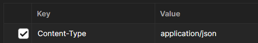
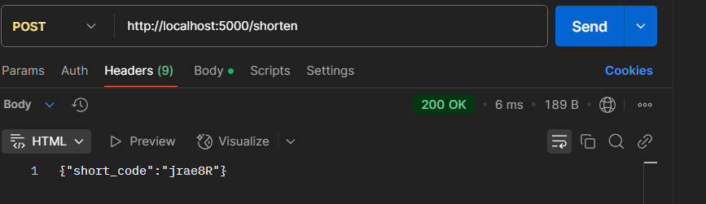
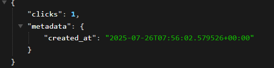
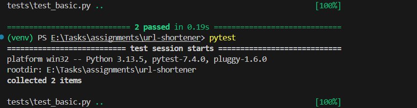

Here is the Detailed breakdown of the Project

First i Installed the python latest version

went  into my root folder

In the terminal started with 
**python -m venv venv**

This runs the python interpreter
-m venu tells python to run built in venv module which is used to create virtual environments
venu -> the name of the folder where the virtual environment will be created.

To activate it we write
**venv\Scripts\activate**

(venv) PS E:\Tasks\assignments\url-shortener> This is what we get

(venu)  indicating you're inside the virtual environment.

****pip install -r requirements.txt ****

This command lets to install all the python packages listed in requirements.txt  (pip-"Pip Installs Packages 
official package manager for Python
)

These are the starting steps

**Models.py**

    url_map = {}    //  Stores the mapping between the shortened URL (short_code) and the original long URL.

    reverse_url_map = {}    # original_url -> short_code
    
    click_count = {}        # short_code -> int 
    
    url_metadata = {}       # short_code -> metadata dict
    
    ex:url_metadata['abc123'] = {
    'created_at': '2025-07-26T07:30:00+00:00'
} 

This is the basic structure How the data is stored in the maps

 **Functions inside it**

 def save_url_mapping(original_url, short_code):
  Saves the mapping between the original and shortened URL and initializes associated metadata.

 def get_original_url(short_code)
 : Purpose: Fetches the original URL for a given short_code.

 def increment_click(short_code):
  Increments the click count for a given short_code if it exists.

  def get_metadata(short_code):
  Returns metadata associated with the short URL.

****main.py **** //flask entry point

Here  @app.route This line is a Flask route decorator, and it tells Flask to do the following:

@app.route(...): This tells Flask which URL path should trigger a specific Python function.

"/shorten": This means that when a client (like a browser or API client) makes a request to the path /shorten, Flask will call the function directly below this decorator — in my case, shorten_url().

methods=["POST"]: This restricts the endpoint to accept only HTTP POST requests (not GET, PUT, etc.).

@app.route("/")
def health_check():
    return jsonify({"service": "URL Shortener API", "status": "healthy"})

Purpose: To test if the service is running properly.

it gives this message if it is running properly  

{
"service": "URL Shortener API",
"status": "healthy"
}

**@app.route("/shorten", methods=["POST"]**)
def shorten_url():
     try:
        data = request.get_json()
        original_url = data.get("url")

Parses the JSON payload from the request body.
Retrieves the url key from the JSON.

  if not original_url or not is_valid_url(original_url):
  return jsonify({"error": "Invalid URL"}), 400

Validation: If no URL is given or it's invalid, return a 400 Bad Request.
 
  short_code = generate_short_code()  // Generates a unique short code (like abc123).
**//stats**
def get_stats(short_code):

Then we write flask run
is used to start a Flask development web server so your Flask application can be accessed in the browser

(venv) PS E:\Tasks\assignments\url-shortener> $env:PYTHONPATH="." pytest
1. $env:PYTHONPATH="."
This sets the PYTHONPATH environment variable to ".", which means "the current directory."

It tells Python and pytest to look in the current folder when resolving import

2. pytest
This runs your test suite using the pytest testing framework.

It automatically finds all files named like test_*.py or *_test.py and runs the test functions inside.

Summary of each test

**1.def client():**
Sets the Flask app into testing mode (TESTING=True).

Creates a test client using app.test_client() which allows you to simulate HTTP requests.

yield client allows this function to be used as a fixture in pytest.

**def test_health_check(client):**

Tests / route is working correctly.

Verifies the status and service fields in the returned JSON.

**def test_shorten_url_invalid(client):**

Sends a bad URL and expects a 400 Bad Request.

**def test_shorten_url(client):  Valid URL Shorten Test**

Sends a valid URL.

Expects a 200 OK response with a non-empty short_code.